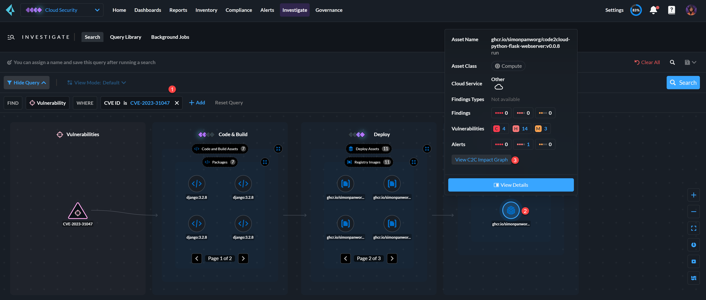
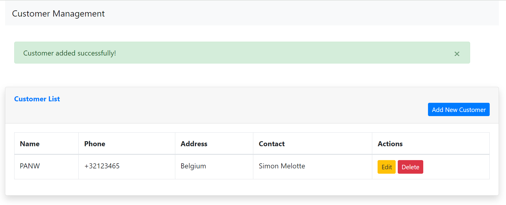
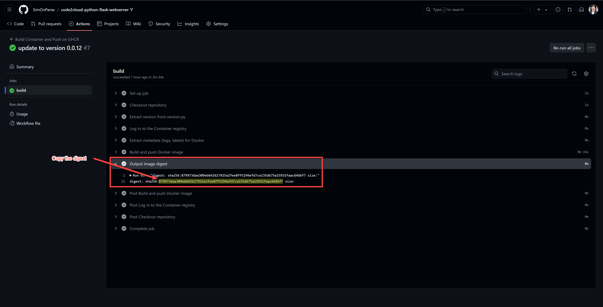
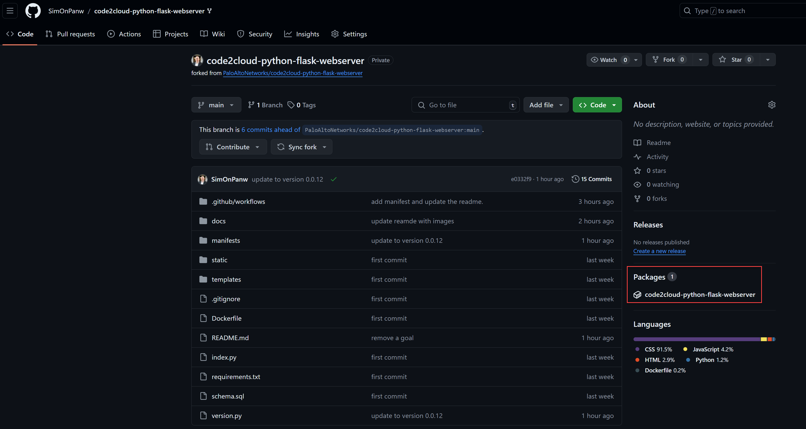
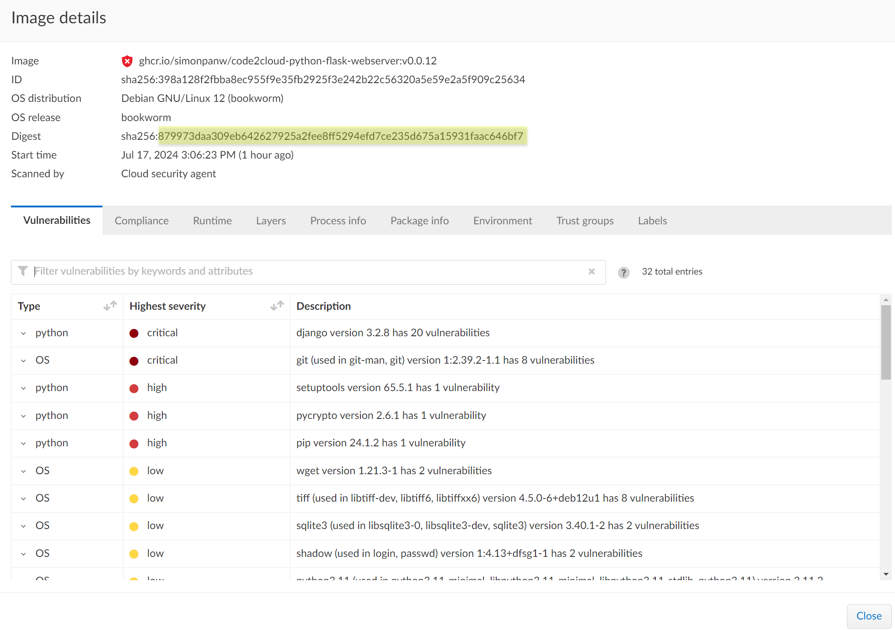

# Code2Cloud Python Flask Application
.
## Description

This repository contains a Python Flask application designed to demonstrate the code-to-cloud traceability feature of Prisma Cloud. The application allows users to manage customer data, showcasing CRUD (Create, Read, Update, Delete) operations, and is containerized for deployment on cloud platforms like AKS, EKS, or GKE. The pipeline utilizes GitHub Actions for CI/CD, building and pushing the Docker image to GitHub Container Registry (GHCR).  

## Illustrations

Code2Cloud traceability is a GA feature and available now. 
#### Code2Cloud Traceability


#### Code2Cloud Impact Graph (BETA)
The impact graph is a **BETA** feature and requires a feature flag to be enabled.  
The steps to access it are as follows:
1. Go to the Investigate tab.
2. Search for a vulnerability with CVE ID: CVE-2023-31047.
3. Click on the runtime container image.
4. Click "View C2C Impact Graph".

#### Code2Cloud Investigate


#### Code2Cloud Impact Graph


## Goals

- Demonstrate code-to-cloud traceability using Prisma Cloud.
- Utilize GitHub Actions for automated CI/CD.
- Deploy the application using Kubernetes manifests.  


## Features

- Add, edit, delete, and list customers.
- Flask-based web application.
- SQLite database for data storage.
- CI/CD pipeline using GitHub Actions.
- Containerized application deployed on Kubernetes.

## Prerequisites
Before you begin, ensure you have the following:  

- **System Admin Access to Prisma Cloud:** You need administrative access to Prisma Cloud to configure and monitor the security settings and ensure proper integration with your Kubernetes cluster.  

- **Kubeadmin Access to AKS, EKS, or GKE:** Ensure you have Kubernetes admin access to your chosen cloud provider's Kubernetes service (Azure Kubernetes Service, Amazon Elastic Kubernetes Service  

- **Prisma Cloud Defender Agent Deployed on K8s Cluster:** The Prisma Cloud Defender agent should be deployed on your Kubernetes cluster and connected to the Prisma Cloud tenant. This ensures that Prisma Cloud can monitor and protect your deployed applications.

- Create your own GitHub Organization
    1. Go to [GitHub](https://github.com/).
    1. In the upper-right corner of any page on GitHub, click your profile photo, then click Settings.
    1. In the "Access" section of the sidebar, click  Organizations.
    1. Next to the "Organizations" header, click New organization.


## Step-by-Step Procedure  

### Fork the Repository
 
- Go to the repository: https://github.com/PaloAltoNetworks/code2cloud-python-flask-webserver.  
- Click the "Fork" button in the top-right corner to create your own copy of the repository

### Create a new repository in your own organization

When you create repositories for C2C, make sure you are creating in a GitHub organization, not the individual repos. Cider doesn’t fetch pipeline and build logs from individual repositories, which are required for C2C.  
Named the new repository: `code2cloud-python-flask-webserver`.


### Onboard the New Repository in Prisma Cloud

Follow the instructions in the Prisma Cloud documentation to connect your GitHub repository:  
[Add GitHub Repository to Prisma Cloud](https://docs.prismacloud.io/en/classic/appsec-admin-guide/get-started/connect-your-repositories/code-repositories/add-github)

### Clone the Forked repository 

Clone your forked repository to your local machine:
```bash
git clone https://github.com/<your-github-username>/code2cloud-python-flask-webserver.git
```

### Update remote URL and push the code on the new repository in your organization

Change the directory and open repository:  

```bash
cd code2cloud-python-flask-webserver
```

In your local repository, set the new remote URL to point to the repository you just created in your organization.
```bash
git remote set-url origin  git@github.com:<your-github-organization>/code2cloud-python-flask-webserver.git
git push -u origin main
```

The push will trigger the GitHub Actions pipeline, which will build the container image and push it to GHCR.


### Create a PAT (Personal Access Token) Token
- Go to your GitHub account settings.
- Navigate to "Developer settings" and then "Personal access tokens."
- Generate a new token with write:packages scope and save it securely.

### Deploy the Application with Manifests Files
Apply the Kubernetes manifests to create the namespace, deployment, and service:
```bash
kubectl apply -f manifests/deployment.yaml
```

### Create a Secret in the K8s Cluster to Pull the Image from GHCR  

Use the PAT token to create a Docker registry secret:
```bash
kubectl create secret docker-registry ghcr-io-creds \
--docker-server=ghcr.io \
--docker-username=<your-github-organization> \
--docker-password=<your_pat_token> \
--docker-email=<your-github-email>
```

### Verify the Deployment
Check the status of the pods to ensure they are running:
```bash
kubectl get pods -n code2cloud
```

Verify the service is created and accessible:
```bash
kubectl get svc -n code2cloud
```

### Access the Web Application
Use the external IP provided by the LoadBalancer service to access the application in your browser.  




### Implement changes on the application

Go to the directory and open repository:  

```bash
cd code2cloud-python-flask-webserver
```

Implement the changes in the source code.

Open the `version.py` file and update the version number:
```python
version = "0.0.10"  # Update to a new version number
```

Open the `manifests/deployment.yaml` file and update the container repository name and the  version number:
```yaml
image: ghcr.io/<your-github-organization>/code2cloud-python-flask-webserver:v0.0.10  # Update the ontainer repository name with your github username and the version number
```

Apply the Kubernetes manifests to create the namespace, deployment, and service:
```bash
kubectl apply -f manifests/deployment.yaml
```

### Troubleshooting by verifying the HASH 

Go to https://github.com/<your-github-organization>/code2cloud-python-flask-webserver/actions/  
Click on latest action and expand the Output image digest step as you can see below:


Go to home page of you repository and click on the Packages: https://github.com/<your-github-organization>/code2cloud-python-flask-webserver


Expand the latest version to verify the digest from the previous step:


Connect to your Prisma Cloud tenant and search for code2cloud from Runtime Security > Monitor > Vulnerabilities > Images > Deployed, click on the image that was deployed on your kubernetes cluster and verify the hash from previous step:


## END
